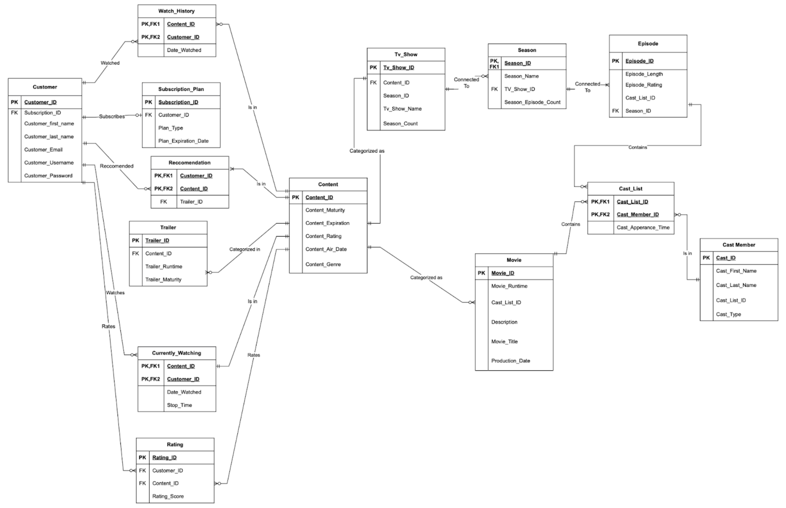

# 🎬 Netflix Database Design Project  

📅 **Date:** October 2024  
📌 **Course:** Advanced Database Design & Management  

## 📖 Overview  
This project involved designing and implementing a **relational database for a streaming platform**, modeled after **Netflix**. The database schema was created using **draw.io**, with a focus on **data integrity, business logic, and complex queries** for **content management, user subscriptions, and watch history tracking**.  

## 🏗️ Entity Relationship Diagram  
  

## 🛠️ Key Features  
### 📌 **Database Schema Design**  
- Designed a **comprehensive database schema** with **14 entities and 57 attributes**, ensuring efficient data organization.  
- Modeled relationships between **content, watch history, subscription plans, and customers** to support data-driven insights.  
- Implemented **primary keys, foreign keys, check constraints, and indexing** for optimized query performance.  

### 📝 **SQL Implementation & Query Optimization**  
- Developed **optimized SQL queries** to extract meaningful insights from the database.  
- **Implemented two stored procedures:**  
  - **Update Procedure:** Allows modification of existing data while maintaining consistency.  
  - **Delete Procedure:** Ensures safe deletion of records with logging for audit purposes.  
- **Created three triggers:**  
  - Logs update operations from the **update stored procedure**.  
  - Logs delete operations from the **delete stored procedure**.  
  - Implements a **business rule trigger** to enforce data constraints and integrity.  
- **Developed two complex queries:**  
  - A query leveraging a **stored procedure** to generate insights based on given inputs.  
  - A **multi-join query** using aggregate functions, subqueries, and CTEs to analyze user engagement and content trends.  

## 🏆 Business Impact & Insights  
- Enables **subscription plan analysis** by tracking customer interactions and payment history.  
- Facilitates **content performance evaluation** through watch history patterns and user engagement.  
- Supports **personalized recommendations** by identifying content preferences and optimizing retention strategies.  

## 🚀 Technologies Used  
- **SQL (Structured Query Language)**  
- **MySQL / PostgreSQL (or other relational databases)**  
- **draw.io (Database schema design)**  

## 📂 Repository Structure  
